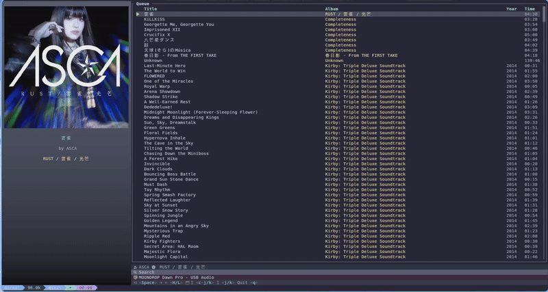

# おと(Oto)

A picky, unstable, yet simple music player.


[](https://ratatui.rs/)




OTO is designed for audiophiles who prefer direct hardware access (ALSA) for bit-perfect playback. This means:

1. **Exclusive Access**: It requires exclusive control of the audio device. Other applications may not be able to play sound while OTO is running.
2. **Minimalist**: It focuses on high-quality playback and does not include "fancy" features like visualizers, streaming integration, or complex library management.

If you need a more general-purpose MPD client or a feature-rich player, consider using [rmpc](https://github.com/mierak/rmpc).

> **Note**: Due to personal interest in minimizing allocations during TUI rendering, the rendering code prioritizes performance over readability.

## Features

- **High-Resolution Audio**: Native DSD (DSF) playback and Hi-Res PCM support
- **Multiple Formats**: FLAC, MP3, WAV, OGG, AAC, DSD/DSF
- **ALSA Backend**: Direct hardware access for optimal audio quality
- **TUI Interface**: Simple terminal UI built with ratatui
- **MPRIS Support**: D-Bus integration for media controls
- **Fuzzy Search**: Quick track search with Japanese romaji support
- **Album Art**: Display cover art in supported terminals

## Installation

```bash
# Standard installation
cargo install --git https://github.com/ckaznable/oto

# Install without Japanese dictionary support (no romaji search)
cargo install --git https://github.com/ckaznable/oto --no-default-features
```

### Dependencies

- Rust 1.92.0+ (nightly recommended for `let_chains` feature)
- ALSA development libraries (`libasound2-dev` on Debian/Ubuntu)
- D-Bus development libraries (`libdbus-1-dev` on Debian/Ubuntu)
- Chafa (`libchafa-dev` or `chafa` package) for image rendering

```bash
# Debian/Ubuntu
sudo apt install libasound2-dev libdbus-1-dev libchafa-dev

# Arch Linux
sudo pacman -S alsa-lib dbus chafa

# Fedora
sudo dnf install alsa-lib-devel dbus-devel chafa-devel
```

## Usage

If you have configured `path` and `device` in `config.toml`, you can simply run:

```bash
oto tui
```

Otherwise, you can specify them via command-line arguments:

### TUI Mode (Interactive)

```bash
# Play music from a directory
oto tui --path /path/to/music

# Specify audio device
oto tui --path ~/Music --device hw:1,0
```

### Headless Mode

```bash
# Play without UI
oto play --path /path/to/music
```

### Initialize Japanese Dictionary (Optional)

```bash
# Download and build dictionary for Japanese track search
oto init
```

## Configuration

OTO can be configured using a `config.toml` file. The configuration file should be placed in the following location:

- **Linux**: `~/.config/oto/config.toml`

### Example `config.toml`

```toml
# Default music directory
path = "/path/to/your/music"

# Default audio device (e.g., "hw:1,0")
device = "hw:1,0"

# Alternatively, specify device by name substring (e.g., "DAC")
# OTO will search for the first device containing this name
device_name = "USB DAC"
```

The search priority for the audio device is:
1. CLI argument (`--device`)
2. `device` field in `config.toml`
3. `device_name` field in `config.toml`
4. Automatically detected USB DACs
5. Default ALSA device (`hw:0,0`)

## Audio Device Selection

OTO automatically detects USB DACs and prioritizes them. To list available devices:

```bash
aplay -l
```

Use the `--device` flag to specify a device:

```bash
oto tui --path ~/Music --device hw:2,0
```

## Feature Flags

| Feature | Description |
|---------|-------------|
| `dict-jp` | Japanese dictionary for romaji search (default) |
| `dict-jp-embed` | Embed dictionary into binary. No download needed, but increases binary size by ~15MB. |

```bash
# Build without Japanese support
cargo build --release --no-default-features

# Build with embedded dictionary
cargo build --release --features dict-jp-embed
```

## Inspired By

- [Amberol](https://gitlab.gnome.org/World/amberol) - A small and simple music player for GNOME
- [rmpc](https://github.com/mierak/rmpc) - A beautiful MPD client for the terminal
- [inori](https://github.com/eshrh/inori) - A beautiful MPD client for the terminal and support fuzzy search

## License

MIT License - see [LICENSE](LICENSE) for details.

## Acknowledgments

- [ratatui](https://github.com/ratatui-org/ratatui) - Terminal UI framework
- [symphonia](https://github.com/pdeljanov/Symphonia) - Audio decoding
- [souvlaki](https://github.com/Sinono3/souvlaki) - MPRIS support
